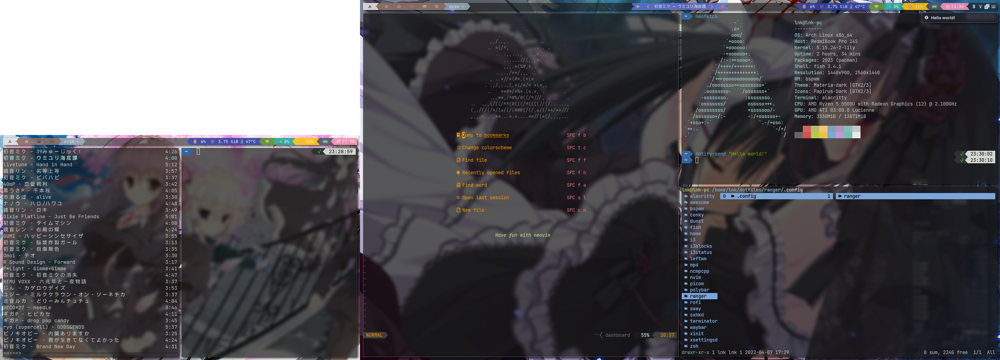

# dotfiles

My dotfiles 😄

## Screenshot



## Use stow

Clone this repository.

```bash
git clone https://github.com/lnkkerst/dotfiles.git
```

Modify file.

Stow package.

```bash
stow -d dotfiles -t $HOME -S PACKAGE_NAME
```
